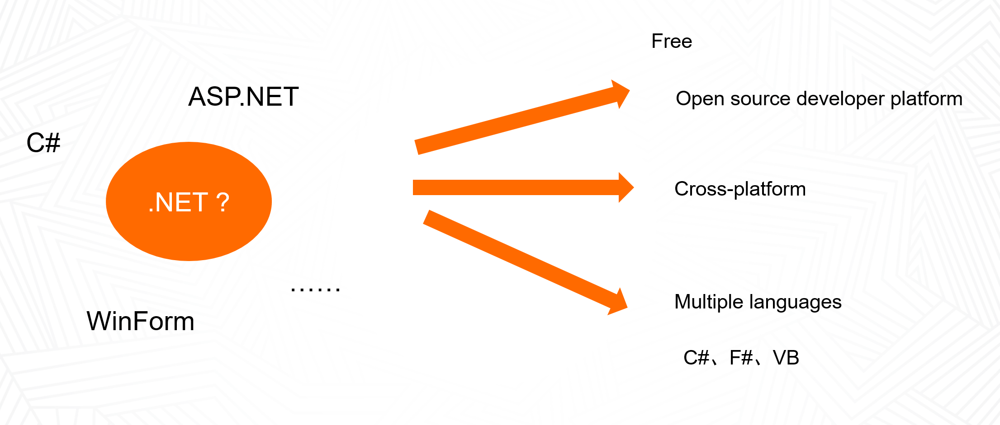
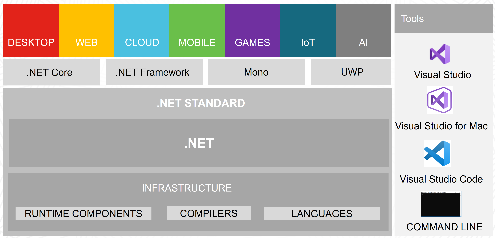

### 什么是.NET
我们常说自己是做.NET开发的，我们需要招.NET开发。那能具体说说.NET开发包含哪些吗？

是不是提到.NET，我们基本都想到C#、ASP.NET、WinForm。所以我们常常会把.NET开发和C#开发画上等号。其实.NET远不止于此。
.NET是一个免费的、开源的开发平台，它支持跨平台方案，并且它支持多语言（C#、F#、VB）。所以.NET更适合表述为一个开发体系。

那么.NET开发体系是什么样的一个结构呢，它包含哪些部分？

如上图，在.NET体系结构的底层，是运行时组件、编译器、核心语言运行时。运行时是用于托管程序的执行环境，操作系统属于运行时，但不属于.NET运行时。在运行时之上是.NET Standard框架，.NET Standard是一组基类库API，它也是目标框架，但.NET Standard不是具体实现。在.NET Standard之上是.NET实现，.NET有四个主要实现：.NET Core、.NET Framework、Mono、UWP。这些实现都实现了.NET Standard。我们会在后面的章节详细介绍这些实现。
基于这些实现，我们可以用.NET开发任意我们想要的app，包括Desktop、Web、Cloud、Mobile、Games、IoT、AI。

那么我们可以使用的工具有哪些呢？
.NET给我们提供了非常方便的Tools，让我们能够轻松开发。这些工具包括：Visual Studio（for window,for mac）、Visual Studio Code（for window,for mac）、Command Line。