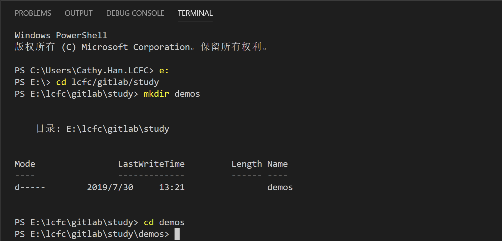
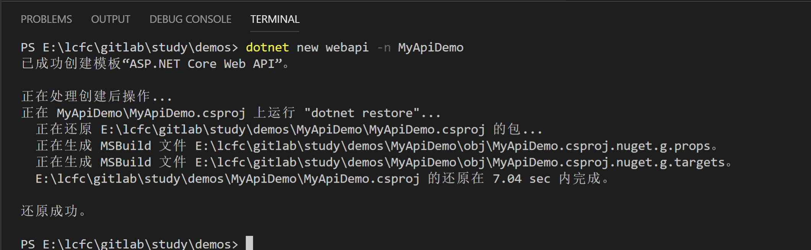

我们都知道.NET Core是跨平台的，那么接下来在Windows、Linux、MacOS上开始尝试.NET Core吧！  
.NET Core最新稳定版本是2.2,我们可以直接在[官网下载](https://dotnet.microsoft.com/download).NET Core SDK。  
#### 创建WebApi Project
打开Visual Studio Code，点击【Terminal】->【New Terminal】，进入终端命令行面板，通过命令行面板创建我们的demo project。首先进入你需要创建project的目录下,输入` cd **/demos `进入demos目录下。

接下来` dotnet new --help `查看新建project命令用法。然后按照命令帮助说明，我们在当前目录下创建一个名为MyApiDemo的webapi项目，命令是` dotnet new webapi -n MyApiDemo `

菜单栏【File】->【OpenFolder】打开我们刚刚创建的project目录MyApiDemo。打开之后，我们什么也不做，先调试运行起来看一下。菜单栏【Debug】->【Start Debugging】，运行起来后，在url后面输入api路由` /api/values `，可以看到api运行返回结果。

#### 认识Startup类
Startup类是一个规范实现类，webapi通常在Startup类中实现服务注册、Http请求管道配置。你也可以没有Startup类，在program.cs中同样可以实现这些。为了让我们的代码清晰易懂、易维护，我们还是按照规范实现Startup类。在Startup中有两个重要的方法：ConfigureService和Configure。  
在ConfigureServices中实现服务注册（该方法是可选的），将我们需要用到的服务都注册到` IServiceCollection `中，比如默认创建的webapi项目，这里有一行代码  
> ` services.AddMvc().SetCompatibilityVersion(CompatibilityVersion.Version_2_2); ` 

` AddMvc `是ASP.NET Core的扩展方法，实现Mvc服务的注册。现在我们自己新建一个service然后实现注册。在根目录下创建Services目录，然后新建UserService.cs。添加注册代码如下  
> ` services.AddScoped<UserService>(); `    

.NET Core注册有几种模式这里简单介绍下：
> ` AddScoped<TService> `生命周期注册，即每个请求会new一个新实例  
> ` AddSingleton<TService> `单例模式注册，只会new一个实例

在Configure方法中实现应用请求管道处理或配置，可以将中间件组件添加到IApplicationBuilder实例来配置请求管道。比如我们可以在Configure中配置异常处理、静态文件处理、重定向等等。
> ` public void Configure(IApplicationBuilder app, IHostingEnvironment env) `  
> ` { `  
> `     app.UseExceptionHandler(errApp => { `  
> `     errApp.Run(async context =>  `  
> `     { `  
> `        context.Response.ContentType = "text"; `  
> `         await context.Response.WriteAsync("ERROR! "); `  
> `          //write your exception handle code `  
> `         }); `  
> `     }); //异常处理 `  
>`     app.UseStaticFiles(); //静态文件配置 `
> `     app.UseHttpsRedirection(); //配置重定向 `  
> `     app.UseMvc(); `  
> ` } `  

#### 内置配置引擎IConfiguration
默认配置文件为appSetting.json，先看一下应用中如何读取appSetting.json文件的内容。默认配置文件在应用初始化的时候，就会加载到IConfiguration引擎中。可以通过在构造函数中注册IConfiguration对象，然后通过IConfiguration读取配置内容。下面的代码段示例在Startup类的构造函数中注册IConfiguration，并读取配置文件内容。
> ` public Startup(IConfiguration configuration) `  
> ` { `  
> `     Configuration = configuration; `  
> `     var connSection = Configuration.GetSection("ConnectionStrings"); `  
> `     var defaultConn = connSection.GetSection("Default").Value; `  
> ` } `  

通过GetSection方法可以读取配置文件的一个节点内容，这是一种方式，我们还可以通过注册IOption<TConfiguration>方式，将配置文件的节点内容映射到指定对象实例上。在Startup的ConfigureServices方法中编写代码实现以下代码，其中Datas是我们自定义的对象，用于接收配置节点内容。然后我们同样在构造函数中注册` IOptions<Datas> `就能直接通过对象实例访问配置数据了。
> ` services.AddOptions(); `  
> ` services.Configure<Datas>(Configuration.GetSection("DataConfig")); `  

还支持一种编写方式，直接绑定配置节点到对象，如下代码片段
> ` Datas appDatas = new Datas(); `  
> ` _config.GetSection("DataConfig").Bind(appDatas); `  

以上都是直接读取的appSettings.json配置文件，如果我们需要自己添加自定义名称的配置文件呢？举例说明，现在我们需要将数据配置的分离出来，新建一个dataConfig.json文件。然后在Program.cs中实现ConfigureAppConfiguration，把dataConfig.json文件添加上。
> ` public class Program `  
> ` { `  
> `     public static void Main(string[] args) `  
> `     { `  
> `         CreateWebHostBuilder(args).Build().Run(); `  
> `     } `  
> `  `  
> `     public static IWebHostBuilder CreateWebHostBuilder(string[] args) => `  
> `         WebHost.CreateDefaultBuilder(args) `  
> `         .ConfigureAppConfiguration((hostingContext,config)=>{ `  
> `             var path = hostingContext.HostingEnvironment.ContentRootPath + Path.DirectorySeparatorChar; `  
> `             config.SetBasePath(path); `  
> `             config.AddJsonFile("dataConfig.json"); `  
> `         }) `  
> `         .UseStartup<Startup>(); `  
> ` } `  

以上代码完成后，使用的代码不需要做任何修改，直接运行起来就可以正常读取到DataConfig了。同时.Net Core内置了对多种类型的配置文件的支持，如：Json、Xml、ini。

