Visual Studio Code是一个轻量的且非常好用的代码编辑工具，并且它支持运行在Windows、macOS和Linux系统上。它内置编译器支持JavaScript,TypeScript和Node.js，并且它有非常丰富的扩展插件可以支持其他开发语言（比如：C++、C#、Java、Python、PHP、Go）。
接下来我们学习VS Code的主要功能。
#### Intelligent Code Completion（智能代码补全）
Visual Studio Code通过安装各种主流开发语言的插件，就可以实现非常智能化的代码编写体验。比如，语法提示、自动带出函数方法、显示方法参数等，总之你在Visual Studio上能体验到的功能都有。
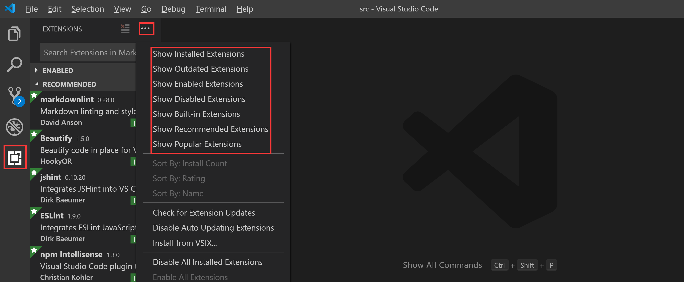
如上图，在vs code的窗口左侧我们点击插件icon时显示上图，可以直接输入插件名称关键词搜索，也可以点击快速查找命令，查找你需要的插件。找到你需要安装的插件后单击右侧窗口会显示插件详细信息。点击【install】进行安装即可。
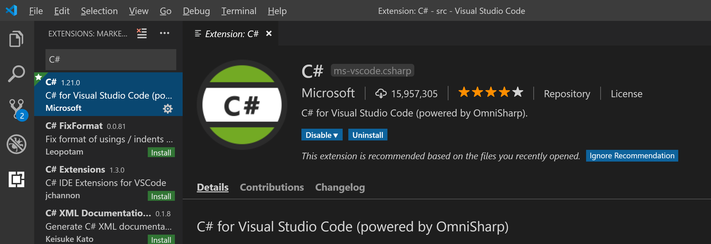
您还可以直接在插件[Marketplace](https://marketplace.visualstudio.com/vscode)直接搜索您想要的插件，直接install，会打开你的vscode并跳转到对应插件的安装界面进行安装。

#### Debugging（调试）
Debug功能同样是除了内置支持的JavaScript、TypeScript、Node.js之外的其他开发语言都是需要安装对应的插件。我们以C#为例，在我们安装了C# Extension之后，打开您的C# Project, vs code是轻量级的，默认以文件夹方式打开您的项目文件目录。选择要启动的项目后，点击工具栏【Debug】-> 【Start Debugging】（或者直接F5快捷键进入调试）。如果是第一次调试，会先弹出选择环境对话框。我们上面提到的C#插件只支持调试.NET Core。
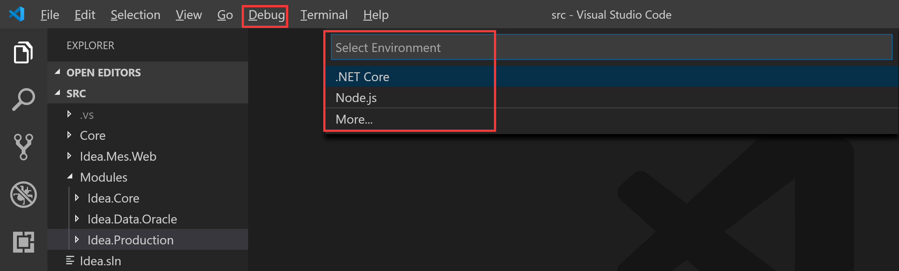
选择环境后，会在你的项目目录下自动生成一个.vscode文件夹，下面还有两个文件分别是launch.json和tasks.json。里面是一些调试启动的配置，可以不用做任何处理，直接再次点击【Start Debugging】开始你的调试工作。
启动调试后，会显示调试工具栏

调试操作和快捷键和Visual Studio是一致的。
* Continue / Pause `F5`
* Step Over `F10`
* Step Into `F11`
* Step Out `Shift+F11`
* Restart `Ctrl+Shift+F5`
* Stop `Shift+F5`

#### Code Navigation & Nuget Manager（代码导航 & 程序包管理）
这部分功能同样和Visual Studio保持一致，我们可以直接右键选择，也可以使用快捷键方便的进行代码导航。
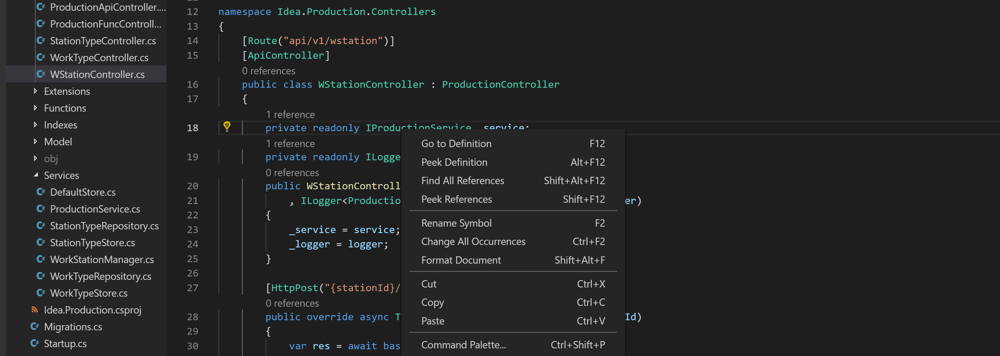
* 跳转到定义`F12`
* 接口实现跳转`Ctrl+F12`
* 引用查找`Shift+F12`  
Extract代码展开折叠,您可以选择需要进行折叠的代码然后按下(`Ctrl+.`),代码左侧会出现+、-可以对代码进行折叠和展开显示。

在vs code中对程序包的管理是需要借助插件的，我们需要在插件市场搜索到Nuget Package Manager并安装。安装好之后，就可以通过快捷键` Ctrl+Shift+P `打开CommandPalette，通过命令进行程序包的添加和移除动作。输入Nuget后命令面板就会有智能提示命令列表，选择相应操作命令，下一步输入Package的名字，支持模糊搜索。然后按照提示选择要操作的Package完成安装或移除。
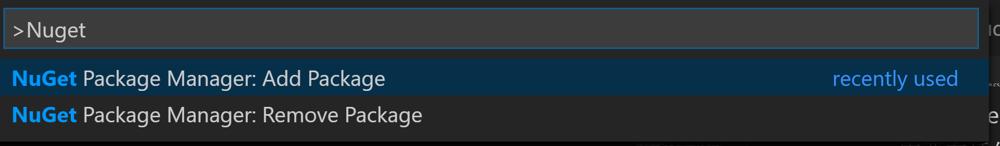

#### Version Control（版本控制）
Visual Studio Code集成了源代码版本控制（包括内置对Git的支持），这里主要介绍Git。vs code对Git的支持需要依赖你的电脑安装的Git客户端（请保证你已经安装了至少2.0.0及以上的Git客户端工具）。  
安装好Git后，我们点击左侧的版本控制icon,打开如下图
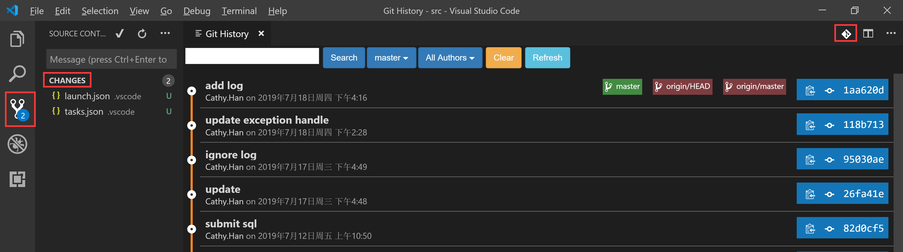
* Commit
左侧【CHANGES】会列出我们有变更的文件,可以直接点击【Commit】icon或者点击【More Actions】icon展开所有操作菜单选择Commit All或者Commit Staged。之后你需要填写提交备注信息，然后才能提交到本地仓储。
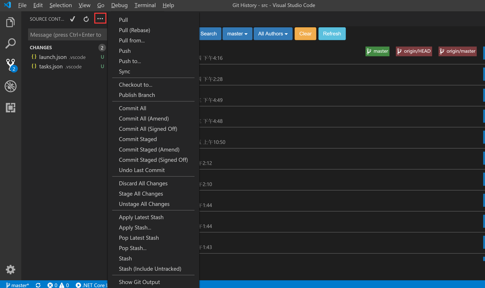
* Cloning a repository 
快捷键Ctrl+Shift+P打开Command Palette，然后输入命令Git: Clone，会自动提示输入Git仓储链接地址，就可以克隆仓储到指定目录了。
* Branches and Tags
使用vs code内置Git支持，要善用Command Palette（Ctrl+Shift+P）,输入命令Git: ***,就能看的智能化的命令提示，比如新建分支：Git: Create Branch，迁出：Git: Checkout to，当输入Checkout to时，会自动列出所有分支和Tag。如果要退出命令操作，请按下ESC键。
* Remote
远程仓储操作有Pull（拉取）、Push（推送）、Sync（同步）。
> Pull将远程仓储更新到本地  
> Push将本地仓储提交推送到远程  
> Sync同时更新本地仓储和远程仓储  

#### Remote Development
远程开发支持连接到一个Docker容器、一台远程机器或者Linux下的Windows子系统来作为我们的开发环境。这是让人非常兴奋的一个功能，这意味着开发人员可以使用完全一致的开发调试环境，可以不关注环境的搭建只专注自己的业务开发，还可以在任意一台装有vs code的机器上快速连接开发环境进行开发工作。我们来看一下如何开始Remote Development。  
首先您需要安装Remote Development插件。
* Remote SSH  
插件安装好后，我们单击左侧远程icon,根据提示Configure a SSH host开始添加一个配置文件。
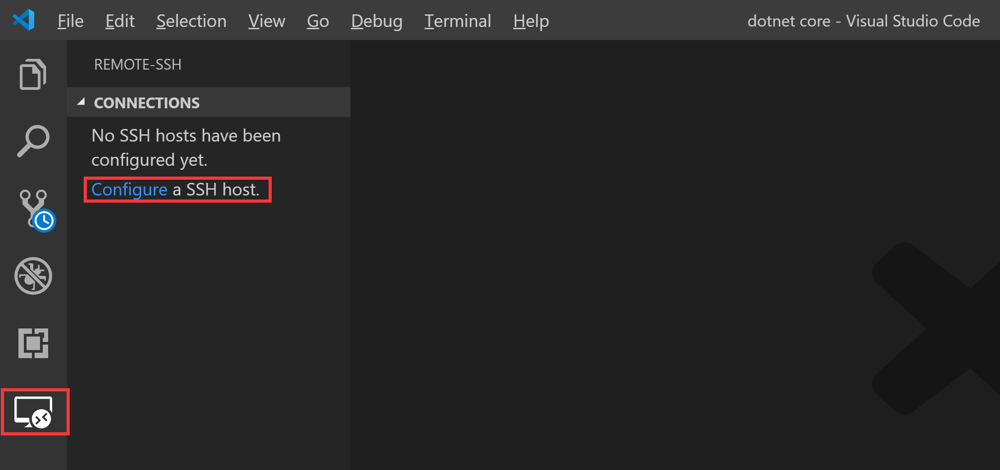
配置文件位置可以自己选择，我这里是默认位置：C:\Users\Cathy.Han.LCFC\.ssh\config，然后按照以下格式编写配置文件。  
> ` # Read more about SSH config files: https://linux.die.net/man/5/ssh_config `   
> ` Host server `  
> `    HostName 172.26.109.122 `  
> `    User root `  
配置文件保存后，在左侧【CONNECTIONS】下面会显示我们刚刚配置的host别名，我这里面设置的别名是server，如下图。
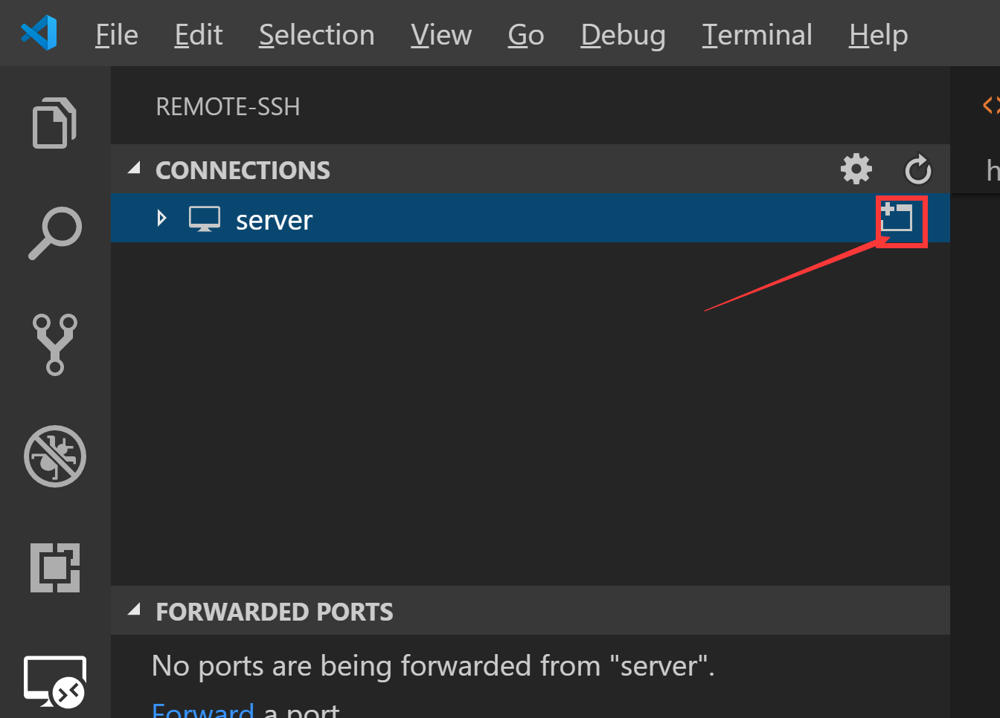
点击icon,会打开一个新的vs code窗口来连接远程host。按照提示输入远程host密码
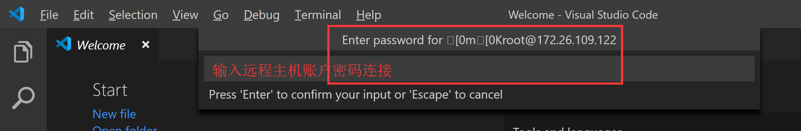
打开我们需要工作的文件夹，比如是你的某个项目源代码目录。然后就可以开始你的编码工作了。
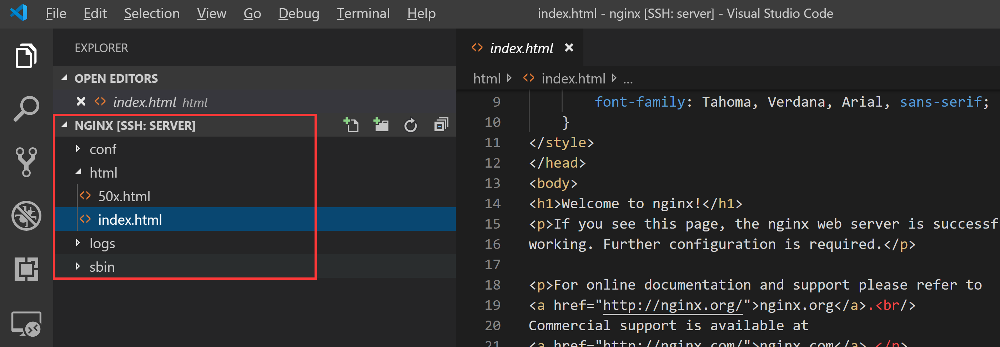

* Containers

